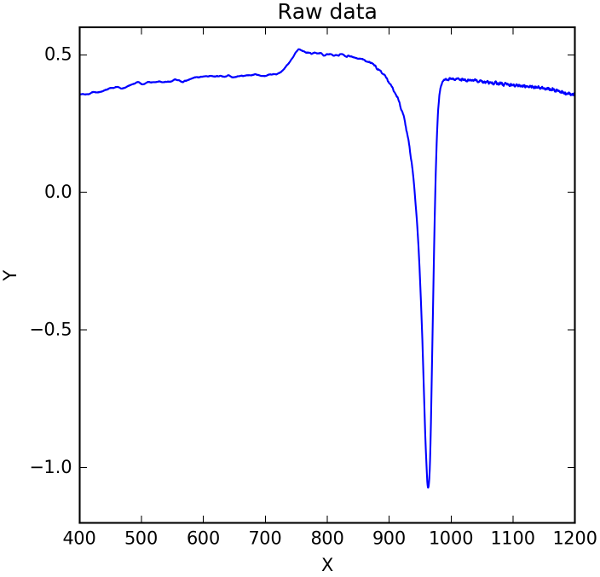

# TPIB - Transformation Peak Iterative Baseline

Iterative baseline computation for a transformation peak

# Summary

This is an algorithm that takes transformation peak data as input, computes a transformation-aware iterative baseline, and returns the peak data with subtracted baseline. It is based on the works of Reis and co-authors [1,2], who were interested in the calorimetric crystallization peak of liquids under constant heating rates. 

During the crystallization peak, two different phases are present at the same time: the liquid and the crystal. These phases have different thermal properties (such as heat capacity, for example) and thus a linear baseline is often not the optimal solution. This algorithm takes into account the amount of transformed phase for each peak datapoint to compute a physically reasonable baseline that is often of sigmoidal shape.

Figure 1: Example of a raw calorimetric data obtained via Differential Scanning Calorimetry (DSC). In this case the X data is the absolute temperature and the Y data is the DSC signal.

Figure 2: Crystallization peak from Figure 1 after running the TPIB algorithm. The peak was normalized to have area equal to one.

There are commercial software available that compute what is called "a sigmoidal baseline". However, two problems arise because of the closed nature of these software: different software can yield different results, and results obtained from the same software for different samples may be unreliable because of some assumption in the code that is not clear to the end user. These two problems can be solved with this open-source code.

# References

[1] Reis, R.M.C.V. (2012). Assessments of viscous sintering models and determination of crystal growth rate and crystallized fraction in glasses. Ph.D. thesis. Universidade Federal de São Carlos.

[2] Reis, R.M.C.V., Fokin, V.M., and Zanotto, E.D. (2016). Determination of Crystal Growth Rates in Glasses Over a Temperature Range Using a Single DSC Run. Journal of the American Ceramic Society 99, 2001–2008.

# Citing the algorithm

Cassar, D. R. (2016). TPIB - Transformation Peak Iteractive Baseline

The paper was submitted for publication to the The Journal of Open Source Software.

# Usage

See `example.py`.

# License

This code is licensed under the GNU GENERAL PUBLIC LICENSE Version 3 of 29 June 2007.
